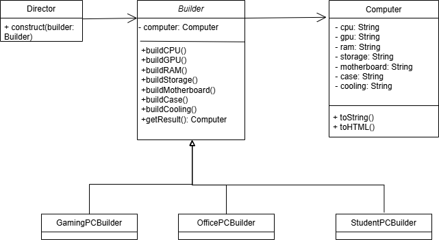

# Отчет по лабораторной работе 1

**Тема:** Применение паттерна проектирования Builder (Строитель) в системе конфигурации персональных компьютеров.  
**Выполнила:** Климова Дарья, 932301.

---

## 1. Описание проблемы предметной области

**Предметная область:** Автоматизация процесса подбора конфигурации персонального компьютера (ПК) в зависимости от целевого назначения (Игровой, Офисный, Учебный).

**Проблема:**  
Процесс создания объекта «Компьютер» является сложным и многоэтапным. Он требует последовательного подбора множества взаимозависимых компонентов: процессора (CPU), видеокарты (GPU), оперативной памяти (RAM), накопителя (Storage), материнской платы (Motherboard), корпуса (Case) и системы охлаждения (Cooling).

**Ключевые сложности реализации без использования паттернов:**

1.  **Различия в требованиях:** Набор обязательных компонентов отличается для разных типов сборок.
    *   Игровой ПК требует мощной дискретной видеокарты и продвинутой системы охлаждения.
    *   Офисный ПК может обходиться встроенной графикой и стандартным коробочным охлаждением, не требуя выбора этих компонентов пользователем.
2.  **Нарушение принципа единственной ответственности (SRP):** Форма вынуждена знать не только как отображать данные, но и какие компоненты совместимы, какие шаги можно пропустить и какие значения подставить по умолчанию.
3.  **Сложность расширения:** Добавление нового типа сборки (например, «Сервер» или «Рабочая станция») потребует переписывания логики формы, добавления новых условий `if/else` и увеличения риска внесения ошибок в существующий функционал.

---

## 2. Решение: Использование паттерна Builder

Для решения описанных проблем в проекте был применен порождающий паттерн проектирования **Builder (Строитель)**.

Паттерн позволяет отделить конструирование сложного объекта (Компьютера) от его представления, что дает возможность создавать различные конфигурации ПК, используя один и тот же процесс конструирования.

### Роли паттерна в проекте:

1.  **Product (Продукт) — класс `Computer`:** Сложный объект, состоящий из множества частей (CPU, GPU, RAM и т.д.). Содержит методы для экспорта конфигурации в строку и HTML.
2.  **Builder (Строитель) — абстрактный класс `Builder` и интерфейс `IBuilder`:** Определяет общий интерфейс для создания всех частей продукта (`BuildCPU()`, `BuildGPU()` и т.д.). Содержит поле для хранения создаваемого объекта `Computer`.
3.  **ConcreteBuilders (Конкретные строители) — классы `GamingPCBuilder`, `OfficePCBuilder`, `StudentPCBuilder`:** Реализуют интерфейс `IBuilder` и предоставляют специфическую реализацию шагов сборки.
    *   `GamingPCBuilder`: Подбирает высокопроизводительные компоненты, все шаги обязательны.
    *   `OfficePCBuilder`: Автоматически подставляет значения по умолчанию для видеокарты (встроенная), корпуса и охлаждения, так как эти шаги не требуют вмешательства пользователя.
    *   `StudentPCBuilder`: Пропускает выбор системы охлаждения (используется боксовый кулер), но требует выбора видеокарты начального уровня.
4.  **Director (Директор) — класс `Director`:** Определяет строгий порядок выполнения шагов сборки. Он принимает конкретный строитель (например, `OfficePCBuilder`) и последовательно вызывает его методы, гарантируя, что объект будет собран корректно согласно выбранному типу. В данной реализации логика Директора отражена в алгоритме работы мастера настройки: последовательность шагов и обязательность компонентов диктуются правилами, заложенными в конкретных строителях.

### UI
В графическом интерфейсе (Windows Forms) паттерн позволил реализовать динамический мастер сборки:
*   Количество шагов мастера определяется типом выбранного строителя.
*   Для упрощения взаимодействия с пользователем лишние шаги (например, выбор видеокарты для офисного ПК) скрыты, а соответствующие поля объекта заполняются значениями по умолчанию внутри конкретных строителей или вспомогательных методов, использующих их логику.

---

## 3. Диаграмма классов

Ниже представлена диаграмма классов архитектуры приложения с применением паттерна Builder.

 

**Описание элементов диаграммы:**
*   `Director` вызывает методы построения у абстрактного `Builder`.
*   `Builder` объявляет методы создания частей продукта.
*   `GamingPCBuilder`, `OfficePCBuilder`, `StudentPCBuilder` наследуются от `Builder` и реализуют специфическую логику подбора компонентов.
*   `Computer` является итоговым продуктом, агрегирующим все созданные компоненты.

---

## 4. Вывод: Влияние внедрения паттерна на работу программы

Внедрение паттерна Builder изменило архитектуру приложения, обеспечив следующие преимущества:

1.  **Соблюдение SRP:** Логика сборки перенесена из формы в классы-строители. Форма отвечает только за UI, не содержа бизнес-правил.
2.  **Гибкость сценариев:** Реализована поддержка разного количества шагов для разных типов ПК (3 шага для Офисного против 7 для Игрового) без усложнения кода формы.
3.  **Принцип Open/Closed:** Добавление новых конфигураций требует создания нового класса-строителя без изменения существующего кода.
4.  **Централизация логики:** Класс `Director` унифицировал порядок сборки, гарантируя корректность создания объекта независимо от способа инициации (UI или код).
5.  **Поддерживаемость:** Код стал модульным; изменения в компонентах локализуются внутри конкретных строителей, снижая риск ошибок в других частях системы.

**Итог:** Использование паттерна Builder позволило превратить монолитную процедуру сбора данных в гибкую, расширяемую и легко поддерживаемую систему, четко разделяющую логику представления (UI) и логику предметной области (сборка ПК).

